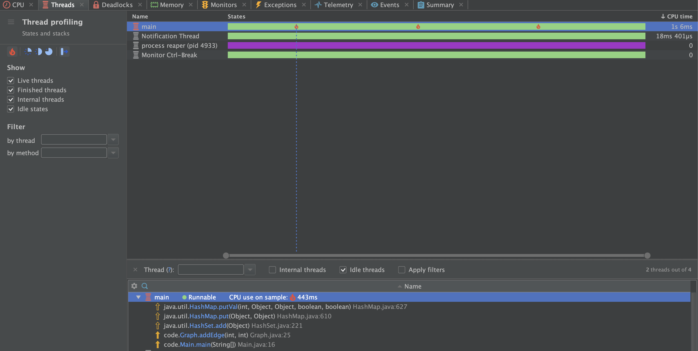

# Software Engineering Lab

## Experiment #5

### Check cycle using DFS

At first, we implemented the cycle detection algorithm using DFS in a graph.

After profiling the Main class, which creates a graph with 10,000,000 vertices 
and runs the hasCycle method, we noticed a large memory usage, especially in the `addEdge` method. 
The profiling results indicated that the `edgesMap` was consuming a large amount of heap memory.

We made the following optimizations:

- Utilizing `pathSet` for Cycle Detection: 
We introduced a pathSet data structure to keep track of vertices in the path from the source vertex to the current vertex. 
This `pathSet` is then used to detect cycles efficiently.

- Switching to `visitedSet`: 
Instead of maintaining a visitedMap, we replaced it with a HashSet named `visitedSet`. 
This change helped in further improving the performance of the cycle detection algorithm.

Here is the resources used by the `Main` and the `OptimizedMain` classes.

### Resource usage in JavaCup Class

The temp() function creates an ArrayList and populates it with 200 million elements using nested loops. 
This can lead to performance issues and potentially cause resource consumption problems like high memory usage.

Instead of relying on the default initial capacity of ArrayList (which may result in frequent resizing of the underlying array), we specify an initial capacity that can accommodate all the elements we intend to add (totalElements).

#### Reduced Resizing Overhead:
By setting the initial capacity of ArrayList to totalElements, we minimize the need for resizing operations during the add() method calls. This reduces memory overhead and potentially improves performance.
#### Clearer Intent: 
The code is more readable and maintains the same logic as the original temp() function, but with explicit optimizations regarding data structure initialization.

By using an appropriate initial capacity for the ArrayList and ensuring that the data structure is efficiently utilized, we can mitigate potential performance issues such as excessive memory allocation and resizing operations. This approach should result in improved resource usage and better performance compared to the original implementation.

As we can see in the profiling the resource usage has been mitigated.

